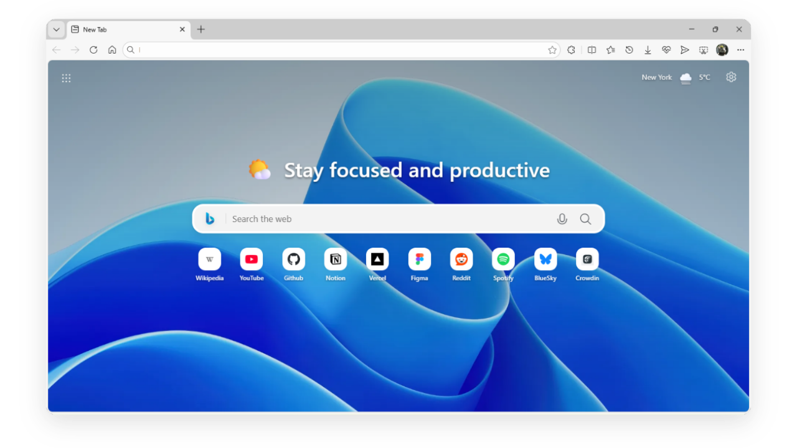

# Fluent New Tab &nbsp;     




<p align="center">
  <strong>A minimalist, privacy-focused New Tab page inspired by Microsoft's Fluent Design.</strong>
</p>

<p align="center">
  <a href="https://github.com/snw-mint/fluent-new-tab/releases">Installation</a> •
  <a href="PRIVACY.md">Privacy</a> •
  <a href="CONTRIBUTING.md">Contributing</a> •
  <a href="TRANSLATING.md">Help translate</a> •
  <a href="LICENSE.md">License</a> •
  <a href="CREDITS.md">Credits</a>
</p>

---

## ✨ Key Features

Experience a browser start page that feels like a native extension of your OS.

*   **🎨 Fluent Design**: Modern aesthetics featuring Mica-like effects, smooth transitions, and dynamic **Dark/Light mode** support.
*   **🚀 Ecosystem Launcher**: Seamlessly switch between **Microsoft 365**, **Google Workspace**, and **Proton AG** productivity suites.
*   **⚡ Smart Dashboard**: Built-in **Weather widget** (powered by WeatherAPI) and a versatile **Search bar** (Bing, Google, etc.).
*   **🔗 Unlimited Shortcuts**: Create a customizable grid for your favorite sites with automatic high-quality favicon fetching.
*   **🔒 Privacy First**: **No tracking. No data collection.** All settings and shortcuts are stored locally (`localStorage`).

---

## 📥 Installation

### Microsoft Add-ons
The easiest way to install is via the official store. Updates are automatic.

<a href="https://microsoftedge.microsoft.com/addons/detail/hcohjkajcimobdddlnfnfhdfnbapondc">
  
</a>

> ⚠️ **Note:** Updates to Microsoft add-ons may take up to 7 business days to appear after a release.

### Manual Installation
For the absolute latest version:
1.  Download the latest `.zip` from the Releases Page.
2.  Unzip the file.
3.  Navigate to `edge://extensions` in your browser.
4.  Enable **"Developer Mode"**.
5.  Click **"Load Unpacked"** and select the unzipped folder.

### Local Development (TypeScript + SCSS)
This project now uses a build step.

1. Install dependencies:
  ```bash
  npm install
  ```
2. Build extension files:
  ```bash
  npm run build
  ```
3. In `edge://extensions`, click **"Load unpacked"** and select the `dist/` folder.

Source files live in `src/`:
- `src/script.ts` → `dist/script.js`
- `src/style.scss` → `dist/style.css`

Runtime files (`script.js` and `style.css`) are generated in `dist/` only.

---

## 🛡️ Privacy Policy

Your privacy is paramount. **Fluent New Tab** operates with a "Local First" philosophy.

*   **No Analytics:** We do not use Google Analytics, Firebase, or cookies.
*   **Storage:** Preferences are stored locally (`localStorage`), with local backup support in `chrome.storage.local`; uploaded wallpapers are stored in IndexedDB.
*   **External Requests:** Only feature-required requests (Open-Meteo weather, wallpaper providers, favicons, optional suggestions) are made directly from your client.

See the full Privacy Policy for details.

## 🤝 Contributing

Contributions are always welcome! Whether you are a developer or a translator, there are ways for you to contribute.

### 🌍 Translations (No Code Required)
Want to use this extension in your native language? You can help us translate it!
👉 **Read the [Translation Guide](TRANSLATING.md)** to learn how to add a new language.

### 💻 Code & Features
Found a bug or have an idea for a new widget?
👉 **Read the [Developer Guide](CONTRIBUTING.md)** for setup instructions and code standards.

---

## ⚖️ License & Legal Notice

The source code of this project is licensed under the **GPL-3.0 license** effective 18/02/2026.

If you choose to fork or distribute this project, you are required to use a different name and logo. Please ensure your version is clearly marked as a fork to avoid confusion with the original project.

**Trademarks Disclaimer:**
The trademarks, logos, and service marks (collectively the "Trademarks") displayed in this project (including but not limited to Microsoft Edge, Google, and Proton) are registered trademarks of their respective owners. 

* **Microsoft 365 Icons:** Microsoft, Outlook, Word, Excel, PowerPoint, OneDrive, OneNote, Teams, To Do, and Copilot are trademarks of **Microsoft Corporation**.
* **Google Workspace Icons:** Google, Gmail, YouTube, Drive, Calendar, Maps, Photos, Meet, Docs, and Sheets are trademarks of **Google LLC**.
* **Proton Suite Icons:** Proton Mail, Calendar, Drive, VPN, Pass, Wallet, and Docs are trademarks of **Proton AG**.

This project is **not affiliated with, endorsed by, or sponsored by** Microsoft, Google, or Proton AG. These assets are used for identification purposes only under Fair Use.