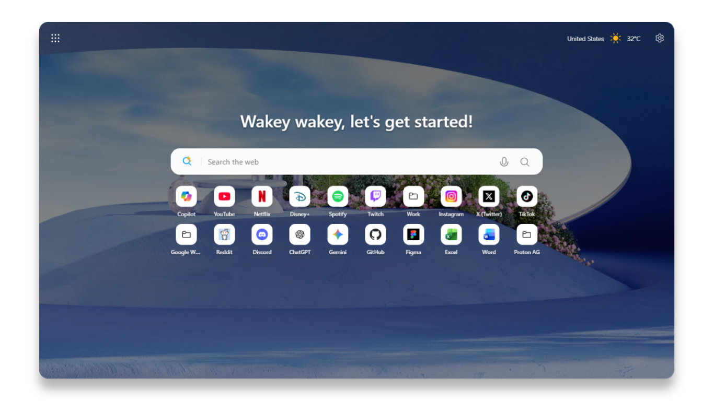

  

<h1 align="center">Fluent New Tab</h1>

  
  
  
  

  <strong>A modern new tab inspired by Fluent Design 2.</strong>

  <a href="https://github.com/snw-mint/fluent-new-tab#installation">Add to Browser</a> •
  <a href="https://github.com/snw-mint/fluent-new-tab/releases">Installation</a> •
  <a href="https://snw-mint.github.io/fluent-new-tab/privacy.html">Privacy</a> •
  <a href=".github/CONTRIBUTING.md">Contributing</a> •
  <a href=".github/TRANSLATING.md">Help translate</a>

## Why choose Fluent New Tab?

- Minimal, lightweight layout focused on productivity.
- Built-in launcher for Microsoft 365, Google Workspace, and Proton.
- Fast search with voice input and optional suggestions.
- Unlimited shortcuts with automatic high-quality favicons.
- Adaptive theme: Light, Dark, or System.
- Privacy-first: no tracking or telemetry.

More details on the [official website.](https://snw-mint.github.io/fluent-new-tab/)

## Installation

The easiest option is the official store, with automatic updates.

> [!NOTE]
> **Edge Add-ons delay:** Microsoft's manual review takes up to 7 business days, which causes the Edge Add-ons version to lag behind. To get immediate updates and bug fixes, we highly recommend installing the version from the Chrome Web Store (fully compatible with Edge).

### Manual installation

For the latest version:

1. Download the latest `.zip` from the Releases Page.
2. Unzip the file.
3. Open `edge://extensions` in your browser.
4. Enable **Developer Mode**.
5. Click **Load Unpacked** and select the unzipped folder.

## Privacy

Fluent New Tab follows a local-first approach.

- No analytics or tracking.
- Settings stored locally (`localStorage`) with optional backup in `chrome.storage.local`.
- Uploaded wallpapers saved in IndexedDB.
- External requests only for required features (weather, wallpapers, favicons, optional suggestions).

See the [privacy policy](https://snw-mint.github.io/fluent-new-tab/privacy.html) for details.

## Contributing

Contributions, feedback, and bug reports are highly appreciated!

- **Bug Reports & Feature Requests:** Please open a GitHub Issue if you found a bug or have a concrete feature request.
- **Questions & Ideas:** Use GitHub Discussions for general questions, showing off your setup, or sharing open-ended ideas.
- **Developers:** Want to run the project locally or submit a Pull Request? Check out our [Contributing Guide](.github/CONTRIBUTING.md) for local development instructions.

## Translations

Fluent New Tab is available in multiple languages thanks to our community!

| Code     | Language         | Contributor    |
| -------- | ---------------- | -------------- |
| `cs_CZ`  | Čeština          | none           |
| `da_DK`  | Dansk            | none           |
| `de_DE`  | Deutsch          | none           |
| `el_GR`  | Ελληνικά         | none           |
| `en_US`  | English (US)     | @snw-mint      |
| `es_ES`  | Español (España) | none           |
| `fil_PH` | Filipino         | @PhilMinecraft |
| `fi_FI`  | Suomi            | none           |
| `fr_FR`  | Français         | none           |
| `hu_HU`  | Magyar           | none           |
| `id_ID`  | Bahasa Indonesia | @GID0317       |
| `it_IT`  | Italiano         | none           |
| `ja_JP`  | 日本語           | none           |
| `ko_KR`  | 한국어           | none           |
| `nl_NL`  | Nederlands       | none           |
| `pl_PL`  | Polski           | none           |
| `pt_BR`  | Português        | @snw-mint      |
| `ro_RO`  | Română           | none           |
| `ru_RU`  | Русский          | none           |
| `sv_SE`  | Svenska          | none           |
| `tr_TR`  | Türkçe           | none           |
| `uk_UA`  | Українська       | none           |
| `vi_VN`  | Tiếng Việt       | none           |
| `zh_CN`  | 中文 (简体)      | none           |
| `zh_TW`  | 中文 (繁體)      | none           |

See the [Translation Guide](_locales/TRANSLATING.md) for more details.

## Support the project

Fluent New Tab is an independent, open-source project maintained solely by me. If you enjoy using the extension and want to help keep it alive, ad-free, and regularly updated, consider supporting my work!

  

Not able to donate? You can still help immensely by **starring this repository**, leaving a review on the extension store, and sharing it with your friends!

## License and legal notice

> [!IMPORTANT]
> "Fluent New Tab" is a strictly non-profit, open-source project. We do not accept paid promotions, data partnerships, or advertising offers. Please do not send unsolicited business inquiries.

This project is licensed under the [GPL-3.0 License](https://github.com/snw-mint/fluent-new-tab/blob/main/LICENSE). By using or modifying this extension, you agree to our [Terms of Use](https://snw-mint.github.io/fluent-new-tab/terms.html).

Forks and distributions must use a different name and logo, and be clearly marked as forks.

Third-party dependencies and assets credits can be found in [CREDITS.md](.github/CREDITS.md). To report security vulnerabilities, please refer to our [Security Policy](.github/SECURITY.md).

All trademarks belong to their respective owners. There is no affiliation or endorsement by Microsoft, Google, or Proton AG.

---

_Prefer a different design? [Try MD3: Expressive New Tab](https://github.com/snw-mint/md3-new-tab)_
